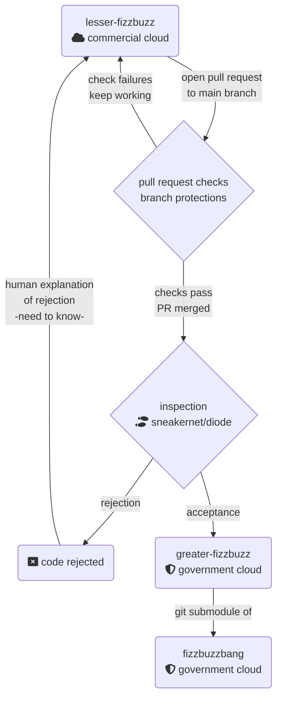

# Some Fantastic

Home of silly demos with a purpose.

## Fizzbuzz

Not content with your standard whiteboard exercise of boring coding interviews, the three repositories demonstrate a "low-to-high" coding exercise where you have some teams who can work on parts of a project without seeing things on the high side.  Here's a high level:

- [lesser-fizzbuzz](https://github.com/some-fantastic/lesser-fizzbuzz) - most work happens here, in commercial clouds :heart:
  - [example issue](https://github.com/some-fantastic/lesser-fizzbuzz/issues/5) tracking promotion of changes from the low side
  - [workflow file](https://github.com/some-fantastic/lesser-fizzbuzz/blob/main/.github/workflows/promotion.yml) that creates a patch file on push to main (which should only happen on PR merge), then creates an issue and adds it to the [organization project](https://github.com/orgs/some-fantastic/projects/1) for tracking.
- [greater-fizzbuzz](https://github.com/some-fantastic/greater-fizzbuzz) - not exactly a fork of :point_up:, but a copy maintained via patches sent over to the high side.
  - [workflow file](https://github.com/some-fantastic/greater-fizzbuzz/blob/main/.github/workflows/application.yml) that fetches, scans, and applies the patch file, then opens a pull request.  This PR will kick off any additional checks needed and provides a _second_ approval process for the receiving side.
- [fizzbuzzbang](https://github.com/some-fantastic/fizzbuzzbang) - the finished product, assembled on the high side. :tada:

:clipboard: [organization project](https://github.com/orgs/some-fantastic/projects/1) tracking all the things going on

:white_check_mark: Good checks to run on lesser-fizzbuzz PRs

- CODEOWNERS and required reviewers to make sure the right :eyes: (and multiple of them) are on the right files every time
- Requiring signed commits means that you know who signed off on each code change
- Regression, integration, unit testing for quality
- Linting for readable pretty code
- SAST for preventing introducing new vulnerablities
- Dependency review for preventing introducing new vulnerable dependencies

Documentation you may find handy:

- [git submodules](https://git-scm.com/book/en/v2/Git-Tools-Submodules)
- [git format patch](https://git-scm.com/docs/git-format-patch) and [git apply](https://git-scm.com/docs/git-apply) for using a [patch based workflow](https://nasamuffin.github.io/git/open-source/email/code-review/2019/05/22/how-i-learned-to-love-email-patches.html)

## Fedora ACS Override

This is a fork of [fedora-acs-override](https://github.com/some-natalie/fedora-acs-override) that adds some matrix builds and doesn't upload the finished product.  It's used for benchmarks and will be used for later cost analysis.  Some work posted [here](https://some-natalie.dev/blog/revisiting-build-times/) already.
